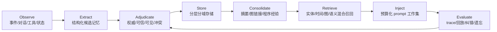
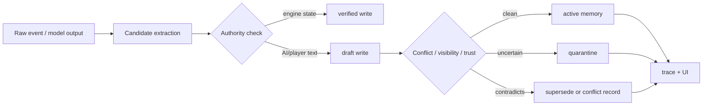

# AI 记忆机制巨量调研与天命 v3 记忆架构蓝图

日期: 2026-05-31  
对象: 天命 AI 记忆系统全面优化前的学术综述、产品生态研究与方案规划  
口径: 本报告整合 6 个并行研究代理、本地补查、前两轮研究笔记，以及天命现有代码结构观察。它不是实现提交，目的是在动手改系统前确定设计边界、评测标准和路线图。

## 0. 一句话结论

天命不应该把 AI 记忆优化理解成“换一个更强的向量库”或“把上下文塞得更长”。更稳的方向是把记忆做成一个可审计的游戏基础设施: 以确定性世界账本为最高权威，以统一 Memory Envelope 连接事件、事实、人物、势力、承诺、伏笔、反思和程序经验，再用分层检索、权限隔离、时效/冲突管理、可视化 trace 和黄金回放测试来约束它。

最适合天命的短中期路线是:

1. 保留现有 12 表、事件史、锚点、L1/L2/L3 摘要、SC_RECALL、语义召回、记忆 UI 等骨架。
2. 在上面加一层统一的记忆包络和检索 trace，而不是推翻重写。
3. 先解决“事实权威、可见范围、过期冲突、注入原因、写入审计、回放评测”六件事。
4. 向量检索继续保留，但放在确定性状态、实体/时间/图检索之后。
5. 长期再考虑自动记忆演化、程序性经验库、多图推理和更强的 NPC 自主记忆技能。

## 1. 本轮研究覆盖面

本轮把资料分为六组:

| 方向 | 代表资料 | 对天命最有用的结论 |
|---|---|---|
| 学术前沿 | [Generative Agents](https://arxiv.org/abs/2304.03442), [MemGPT](https://arxiv.org/abs/2310.08560), [AriGraph](https://arxiv.org/abs/2407.04363), [A-MEM](https://arxiv.org/abs/2502.12110), [Mem0](https://arxiv.org/abs/2504.19413), [Zep/Graphiti](https://arxiv.org/abs/2501.13956), [Memory OS](https://arxiv.org/abs/2506.06326), [MIRIX](https://arxiv.org/abs/2507.07957), [MAGMA](https://arxiv.org/abs/2601.03236) | 记忆是生命周期系统: 写入、组织、更新、检索、注入、评估、遗忘、回滚。 |
| 评测与失败 | [LongMemEval](https://arxiv.org/abs/2410.10813), [LoCoMo](https://aclanthology.org/2024.acl-long.747/), [RULER](https://arxiv.org/abs/2404.06654), [StructMemEval](https://arxiv.org/abs/2602.11243), [STALE](https://arxiv.org/abs/2605.06527), [PersistBench](https://arxiv.org/abs/2602.01146), [LongMemEval-V2](https://arxiv.org/abs/2605.12493) | 重点不是能不能搜到旧文本，而是能不能处理多会话、时间、更新、拒答、结构和隐私边界。 |
| 游戏/NPC/多智能体 | [Voyager](https://arxiv.org/abs/2305.16291), [M2PA](https://aclanthology.org/2025.findings-acl.1191/), [PANGeA](https://ojs.aaai.org/index.php/AIIDE/article/view/31876), [Concordia](https://arxiv.org/abs/2312.03664), [MineNPC-Task](https://arxiv.org/abs/2601.05215) | NPC 记忆必须分角色视角；GM/史官账本和 NPC 信念不能混同。 |
| 酒馆/角色扮演生态 | [SillyTavern World Info](https://docs.sillytavern.app/usage/core-concepts/worldinfo/), [Data Bank](https://docs.sillytavern.app/usage/core-concepts/data-bank/), [Chat Vectorization](https://docs.sillytavern.app/extensions/chat-vectorization/), [Summarize](https://docs.sillytavern.app/extensions/summarize/), [CharMemory](https://github.com/bal-spec/sillytavern-character-memory), [MemoryBooks](https://github.com/aikohanasaki/SillyTavern-MemoryBooks/blob/main/readme.md), [MessageSummarize](https://github.com/qvink/SillyTavern-MessageSummarize), [VectFox](https://github.com/KritBlade/VectFox), [TunnelVision](https://github.com/Coneja-Chibi/TunnelVision), [Timeline Memory](https://github.com/unkarelian/timeline-memory) | 最好用的不是全自动黑盒，而是可编辑、可回滚、可查看注入原因的分层记忆。 |
| 生产框架 | [Mem0/OpenMemory](https://mem0.ai/openmemory), [Zep/Graphiti](https://www.getzep.com/platform/graphiti/), [Letta/MemGPT](https://docs.letta.com/guides/agents/architectures/memgpt), [LangMem/LangGraph](https://docs.langchain.com/oss/python/concepts/memory), [Honcho](https://honcho.dev/docs/v2/documentation/core-concepts/architecture), [Cheshire Cat](https://cheshire-cat-ai.github.io/docs/framework/cat-components/memory/long_term_memory/), [Memobase](https://memobase.ai/docs), [Supermemory](https://github.com/supermemoryai/supermemory), [Mengram](https://docs.mengram.io/) | 生产系统都在做 scope、namespace、trace、后台抽取、图/混合检索和治理。单机游戏应先 local-first。 |
| 认知基础 | [Tulving](https://garfield.library.upenn.edu/classics1987/A1987K827400001.pdf), [Baddeley](https://www.nature.com/articles/nrn1201), [CLS](https://web.stanford.edu/~jlmcc/papers/McCMcNaughtonOReilly95.pdf), [ACT-R](https://link.springer.com/article/10.1007/s42113-023-00189-y), [Soar](https://kilthub.cmu.edu/articles/journal_contribution/Soar_an_architecture_for_general_intelligence/6618113), [Source Monitoring](https://pubmed.ncbi.nlm.nih.gov/8346328/) | 工程启发是分类型、分权威、分时效、保来源；不是把 AI 说成真的像人脑。 |

## 2. 研究共识: 记忆系统的 8 个环节

不同论文和产品词汇很多，但收敛到同一条流水线:



### 2.1 写入不是保存全文

酒馆类工具常有“保存全部聊天记录然后向量搜”的惯性，但研究和产品都说明这不够。更稳的写入是从原始事件派生出 typed memory:

- 事件: 何时何地谁做了什么，结果是什么。
- 事实: 当前世界状态、角色身份、制度设定、物品归属。
- 信念: 某 NPC 或势力认为发生了什么。
- 关系: 信任、仇怨、盟约、从属、血亲、师承。
- 承诺: 皇命、交易、誓言、外交条款、任务约束。
- 伏笔: 未结算张力、触发条件、可能 payoff。
- 反思: 失败原因、局势解释、人物心理总结。
- 程序经验: 某类局势中可复用的行动模板。

### 2.2 检索不是 top-k 向量

向量检索擅长找“语义相似”，但游戏记忆经常要找“权威正确、当前有效、角色可知、叙事相关”。因此检索顺序应大致是:

1. 硬状态和当前约束: 游戏引擎、当前表格、活跃皇命、有效盟约。
2. 实体/关键词/FTS: 人名、地名、派系、诏令、事件 id。
3. 时间/有效期: valid_from、valid_to、superseded、turn range。
4. 关系/因果图: 谁影响谁，哪个事件导致哪个后果。
5. 向量语义: 找相似旧片段、旧对话、旧反思。
6. 重排和预算: 权威、可信、重要性、新鲜度、目标相关、token 成本、多样性。
7. 注入 trace: 为什么进 prompt，放在哪里，被哪个预算截断。

### 2.3 长上下文不是记忆系统

[Lost in the Middle](https://arxiv.org/abs/2307.03172), [RULER](https://arxiv.org/abs/2404.06654), [LoCoMo](https://arxiv.org/abs/2402.17753) 以及长期对话评测共同说明: 模型拥有长上下文，不代表它会正确使用上下文。对天命来说，把更多历史塞进 prompt 会带来三个问题:

- 关键事实被埋没。
- 旧事实和新事实混杂，模型接受错误前提。
- 隐藏信息或无关记忆被带入不该出现的角色视角。

所以 prompt 应该是 curated working set，不是 archive。

### 2.4 过期事实是核心难题

[STALE](https://arxiv.org/abs/2605.06527), [Zep/Graphiti](https://arxiv.org/abs/2501.13956), [LongMemEval](https://arxiv.org/abs/2410.10813) 都把“新事实废止旧事实”视为核心能力。游戏里这比普通聊天更重要:

- 旧盟约已破裂，但摘要还说双方同盟。
- 官员已罢免，但 NPC 对话仍称其为尚书。
- 边城已失守，但计划仍按旧疆界推演。
- 皇命已经被新诏覆盖，但旧约束仍被注入。

天命需要把 status、valid_from、valid_to、supersedes、contradicts、sourceRefs 做成一等字段。

### 2.5 记忆安全不是外部附属

长期记忆天然是攻击面和污染面。相关资料包括 [Memory Poisoning Attack and Defense](https://arxiv.org/abs/2601.05504), [A-MemGuard](https://arxiv.org/abs/2510.02373), [PersistBench](https://arxiv.org/abs/2602.01146), [Remembering More, Risking More](https://arxiv.org/abs/2605.17830), [MemMorph](https://arxiv.org/abs/2605.26154), [CIMemories](https://arxiv.org/abs/2511.14937), [Unveiling Privacy Risks in LLM Agent Memory](https://aclanthology.org/2025.acl-long.1227/)。

天命的等价风险不是企业 PII，而是:

- 玩家或模型把未确认内容写成事实。
- 摘要漂移后变成永久世界观。
- NPC 使用 GM 隐藏情报。
- 某势力知道了只有玩家/史官知道的秘密。
- 旧失败反思变成过强偏见，长期束缚 NPC 行动。
- 工具或行动选择被错误记忆引导。

## 3. 学术机制地图

### 3.1 记忆流和反思

[Generative Agents](https://arxiv.org/abs/2304.03442) 的经典结构是 memory stream、reflection、planning。它的价值不在于照搬 Smallville，而在于给出一个 believable agent loop:

- 观察进入记忆流。
- 按 recency、importance、relevance 取回。
- 周期性反思，把事件压缩成高阶信念。
- 计划和行动受反思影响。

天命可借鉴“事件到反思”的方向，但不能让反思覆盖事实账本。

### 3.2 虚拟内存和 Memory OS

[MemGPT](https://arxiv.org/abs/2310.08560), [Memory OS of AI Agent](https://arxiv.org/abs/2506.06326), [MemOS](https://arxiv.org/abs/2507.03724) 把上下文窗口看作稀缺工作记忆，把外部存储看作长期记忆层。对天命的直接翻译:

- prompt = working memory。
- 当前诏令、当前战局、当前 NPC 视角 = core working set。
- 旧事件、旧对话、旧反思 = recall/archive。
- 晋升、降级、压缩、废止、锁定都要显式。

### 3.3 图、时间和因果

相关资料包括 [HippoRAG](https://arxiv.org/abs/2405.14831), [AriGraph](https://arxiv.org/abs/2407.04363), [Zep/Graphiti](https://arxiv.org/abs/2501.13956), [MAGMA](https://arxiv.org/abs/2601.03236), [REMem](https://arxiv.org/abs/2602.13530)。它们共同说明: 长期记忆不能只有扁平片段，至少要能回答:

- 谁和谁有关。
- 关系从什么时候开始。
- 关系是否仍有效。
- 哪个事件导致了当前状态。
- 这条传闻来自谁。
- 某角色为什么恨/信任/害怕另一个角色。

天命已有 relation helpers 和 eventHistory，非常适合演进成轻量实体-事件-时间-因果图。

### 3.4 程序性记忆和工作流

相关资料包括 [Voyager](https://arxiv.org/abs/2305.16291), [Agent Workflow Memory](https://arxiv.org/abs/2409.07429), [Memp](https://arxiv.org/abs/2508.06433), [ProcMEM](https://arxiv.org/abs/2602.01869), [MemSkill](https://arxiv.org/abs/2602.02474)。它们关注“过去经验如何变成以后会做的事”。

天命中的程序性记忆不应是代码技能库，而是策略模板:

- 赈灾安抚能降低民怨，但会增加财政压力。
- 削藩会激化宗室联动，适合先分化再下诏。
- 冬季远征需要粮道，否则军心衰退。
- 对某派系谈判前先满足礼法/面子诉求。

程序性记忆的权威应低于规则、账本、当前约束。它提供建议，不裁决世界。

### 3.5 自演化和 agentic memory

[A-MEM](https://arxiv.org/abs/2502.12110), [Agentic Memory/AgeMem](https://arxiv.org/abs/2601.01885), [EvoMemBench](https://arxiv.org/abs/2605.18421), [EvolveMem](https://arxiv.org/abs/2605.13941), [Mem-alpha](https://arxiv.org/abs/2509.25911) 代表更激进方向: 让系统学会何时写、何时查、何时删、何时更新。

这对天命有启发，但不适合第一阶段直接上。原因:

- 没有足够 campaign replay 数据。
- 没有稳定的行动成功指标。
- 自演化策略可能把系统调得不可解释。
- 叙事系统对可控性和可复现性要求高。

近期应先把操作集暴露出来: store、retrieve、update、summarize、pin、archive、supersede、quarantine、forget/rollback。

## 4. 酒馆和 AI RPG 生态给出的产品答案

### 4.1 主流记忆形态

| 形态 | 代表 | 优点 | 风险 | 天命可借鉴点 |
|---|---|---|---|---|
| Lorebook/World Info | SillyTavern World Info, RisuAI, NovelAI, KoboldAI | 稳定、可编辑、用户理解成本低 | 关键词漏触发/误触发，手写维护成本高 | 用于世界设定、制度、人物静态设定、常驻约束 |
| Data Bank/RAG | SillyTavern Data Bank, Agnai Embeds | 可处理长文档和历史资料 | 向量相似不等于当前相关，重算/阈值/缓存麻烦 | 用于旧档案、史书、长剧情资料，不当最高权威 |
| Chat Vectorization | SillyTavern Chat Vectorization, VectHare | 能找旧对话片段 | 可能破坏 prompt cache，召回语义相似但状态错误 | 保留为辅助 recall |
| Summarize | SillyTavern Summarize | 压缩主线，成本低 | 摘要漂移、漏细节、幻觉 | 摘要必须可编辑、可回滚、能回链原始事件 |
| Per-message summary | MessageSummarize | provenance 清楚，污染范围小 | UI 工作量更大 | 事件摘要应绑定 source event |
| EventBase | VectFox | 抽取事件类型、角色、地点、因果、开放线索 | 仍需校验，且不等于状态 tracker | 非常适合天命 eventHistory 升级 |
| Timeline/chapter memory | Timeline Memory, MemoryBooks | 章节层次适合长 RP | 可能把叙事摘要当事实 | 对应天命回合/年月/朝代层级 |
| Tool-call memory | TunnelVision | 模型可主动搜索/更新/重组 | 自治写入风险高 | 可做高级调试/设计师工具，运行时谨慎 |
| Cloud memory | LoreVault, hosted APIs | 零配置，产品化 | 隐私、成本、可用性、迁移风险 | 不作为单机运行时基础 |

### 4.2 生态最强共识: 可观察和可修订

角色扮演用户并不要求自动记忆完美；他们更关心:

- 我能看见这次注入了什么。
- 我能知道为什么它被注入。
- 我能编辑、合并、删除、降权、锁定。
- 我能区分“事实、猜测、摘要、伏笔、当前状态”。
- 我能避免角色看到不该看到的秘密。

因此天命的 Memory Inspector 至少应包含:

1. 本轮候选记忆。
2. 最终注入记忆。
3. 每条命中原因: 关键词、实体、向量、图路径、时间、重要性、active constraint。
4. 来源: 表、事件、摘要、NPC 记忆、语义召回、外部 adapter。
5. 作用域和可见范围。
6. token 成本和插入位置。
7. 状态: active、superseded、conflicted、archived、quarantined。
8. 玩家/设计师操作: pin、edit、merge、demote、delete、rollback。

## 5. 天命现状判断

天命不是从零开始。现有系统已经有很多正确方向:

- `web/tm-memory-tables.js` 有 12 表结构、`eventHistory`、活跃皇命、组织/地点/关系/大事记、`buildFutureConstraints()`、`buildTablesInjection()`、`applyAIOps()`。
- `eventHistory` 已经有 turn、description、weight、dimension labels、linked chars、future constraints。
- 表 helper 已经有 supersedes、contradicts、continues、elaborates 这类关系。
- `web/tm-memory-anchors.js` 有 anchors、execution constraints、player decisions、character arcs、archive compression、freshness。
- `web/tm-post-turn-jobs.js` 已有 L2/L3 总结、反思、faction arcs。
- `web/tm-endturn-ai.js` 已有 `sc0.memoryQueries` 和 `SC_RECALL`，能查 NPC、chronicle、shiji、foreshadow、semantic recall。
- `web/tm-semantic-recall.js` 已有本地中文 embedding 和 shiji/chronicle/foreshadow/eventHistory 索引。
- `web/tm-memory-ui.js` 已有 Ctrl+M 记忆面板、表编辑、row locks、soft delete、皇命编辑、语义召回开关。
- Godot 侧外交记忆和 broken/renewed commitments 测试已经证明“确定性引擎记忆影响策略”是可行的。

真正的问题不是“有没有记忆”，而是“这些记忆还没有像一个统一系统那样被治理”:

- 多个存储并列存在，但缺少统一 Memory Envelope。
- 有召回，但缺少面向玩家/设计师的 why-injected trace。
- 有摘要，但 provenance、纠错、废止、冻结还不够强。
- 有关系 helper，但图还不是主要检索面。
- 有语义 recall，但权威低于硬状态这一点需要制度化。
- 有隐藏信息概念，但 visibility/audience 需要成为每条记忆的字段。
- 有 smoke tests，但缺少 campaign memory golden regression。

## 6. 天命 v3 目标架构: Memory Constitution + Memory Spine

### 6.1 最高原则

1. 硬状态高于 AI 记忆。
2. 当前有效事实高于旧摘要。
3. 史官账本高于 NPC 信念。
4. NPC 信念可以错，但必须标注视角。
5. 程序经验只能建议，不能裁决。
6. 摘要不是事实，必须能回到来源。
7. 隐藏信息默认不可见，必须显式授权。
8. 每次注入都要留下 trace。
9. 每次长期写入都要能撤销、废止或降级。
10. 评测先于自演化。

### 6.2 统一 Memory Envelope

建议在现有表和记忆层上增加统一包络，而不是立即搬迁所有数据:

```ts
type MemoryKind =
  | "working"
  | "episodic"
  | "semantic"
  | "procedural"
  | "belief"
  | "commitment"
  | "foreshadow"
  | "reflection"
  | "security";

type MemoryStatus =
  | "active"
  | "draft"
  | "superseded"
  | "contradicted"
  | "expired"
  | "archived"
  | "quarantined"
  | "deleted";

interface MemoryEnvelope {
  id: string;
  kind: MemoryKind;
  lane: string;
  status: MemoryStatus;

  worldId: string;
  saveSlotId: string;
  sceneId?: string;
  actorIds?: string[];
  factionIds?: string[];
  locationIds?: string[];
  questIds?: string[];

  visibility: "gm_only" | "player_known" | "public" | "actor_known" | "faction_known" | "hidden";
  audience?: string[];
  authority: "engine_state" | "system_rule" | "gm_ledger" | "verified_extract" | "npc_belief" | "summary" | "semantic_recall" | "llm_reflection" | "user_input";

  summary: string;
  rawExcerpt?: string;
  sourceRefs: string[];
  sourceType: "game_event" | "dialogue" | "edict" | "table_row" | "tool_output" | "llm_summary" | "player_note" | "imported_doc";

  turn?: number;
  validFromTurn?: number;
  validToTurn?: number;
  learnedAtTurn?: number;
  expiresAtTurn?: number;

  confidence: number;
  importance: number;
  trust: number;
  decay: number;
  reinforcement: number;

  supersedes?: string[];
  contradictedBy?: string[];
  supports?: string[];
  causes?: string[];
  consequenceOf?: string[];
  openThreads?: string[];

  tags?: string[];
  promptPolicy?: {
    allowInjection: boolean;
    preferredSection?: string;
    maxTokens?: number;
    requiresTrace: boolean;
  };

  audit: {
    createdBy: "engine" | "ai" | "player" | "adapter" | "migration";
    createdAt: string;
    updatedAt?: string;
    lastInjectedTurn?: number;
    correctionHistory?: string[];
  };
}
```

这不是要求一次性把所有表重构为一个大表，而是要求所有进入检索/注入/审计的记忆都能投影成这个包络。

### 6.3 Memory Lanes

| Lane | 内容 | 权威 | 写入方式 | 检索方式 |
|---|---|---|---|---|
| Hard State | 当前资源、地盘、官职、法令状态、外交状态 | 最高 | 引擎/表 | 必注入或确定性读取 |
| Canon/Semantic | 世界设定、制度、人物静态设定、地点组织 | 高 | 表/设计数据/确认写入 | 实体/关键词/常驻 |
| Episodic Event | 回合事件、对话承诺、战役、灾荒、谋反、奖惩 | 中高 | 事件抽取/表写入 | 实体+时间+向量 |
| Commitment | 皇命、盟约、约定、任务、债务 | 高 | 专门抽取+有效期管理 | 当前有效优先 |
| Belief | NPC/势力相信的事实、误会、偏见、秘密 | 中 | 从可见事件派生 | actor/faction scope |
| Relationship | 信任、仇怨、忠诚、血亲、师承、派系 | 中高 | 事件 delta + 表 | 图/实体 |
| Foreshadow | 伏笔、未结张力、触发条件、payoff 候选 | 中 | AI/设计师 | 条件触发+叙事检索 |
| Reflection | 局势解释、失败复盘、人物弧线 | 中低 | L2/L3/反思任务 | 目标相关检索 |
| Procedural | 治理/外交/军事/叙事策略模板 | 低 | 成功/失败轨迹蒸馏 | 任务类型检索 |
| Quarantine | 可疑、冲突、未确认、被攻击污染的记忆 | 默认不注入 | 写入守卫 | 调试/人工确认 |

### 6.4 Retrieval Composer

每次生成前，Memory Spine 应产出一个 `MemoryTrace`:

```ts
interface MemoryTrace {
  requestId: string;
  turn: number;
  actorScope?: string;
  sceneGoal: string;
  queryPlan: {
    entities: string[];
    timeRange?: [number, number];
    lanes: string[];
    semanticQueries: string[];
    graphQuestions: string[];
  };
  candidates: Array<{
    memoryId: string;
    source: string;
    scoreParts: Record<string, number>;
    rejectedReason?: string;
  }>;
  injected: Array<{
    memoryId: string;
    section: string;
    tokenEstimate: number;
    reason: string;
  }>;
  budget: {
    total: number;
    byLane: Record<string, number>;
    truncated: string[];
  };
}
```

检索算法建议:

1. 从当前场景、行动目标、参与人物、地点、势力、皇命中生成 query plan。
2. 必取 Hard State、当前有效 Commitment、当前场景 Canon。
3. 查实体/关键词/FTS，优先当前人物、地点、势力。
4. 查时间和状态，过滤 superseded/expired/hidden/quarantined。
5. 查关系/因果图，补足 multi-hop 证据。
6. 查语义召回，作为旧事件和旧反思的补充。
7. 重排，权重至少包括 relevance、authority、freshness、importance、visibility、trust、narrative promise、diversity、token cost。
8. 按 lane 预算注入，并记录截断原因。

### 6.5 写入守卫

所有长期写入都过一个 Memory Write Queue:



写入候选至少分三档:

- Verified: 来自引擎状态、明确表操作、确定性脚本。
- Draft: 来自 LLM 摘要、玩家自由文本、对话承诺抽取。
- Quarantine: 来源不可信、和硬状态冲突、可见范围可疑、疑似提示注入或污染。

## 7. 评测方案

### 7.1 黄金回放集

天命应建立一套 campaign memory golden tests，而不是只测单函数:

| 测试类型 | 场景 | 期望 |
|---|---|---|
| 当前事实 | 官员被罢免后再次询问其职位 | 回答新职位或已罢免，不用旧摘要 |
| 皇命覆盖 | 旧诏被新诏废止 | prompt 注入新诏和废止关系，不注入旧诏为 active |
| 隐藏信息 | NPC 未获知 GM 伏笔 | NPC 不泄露、不基于该伏笔行动 |
| 角色视角 | A 知道密报，B 不知道 | A 的 prompt 可见，B 的 prompt 不可见 |
| stale premise | 用户诱导“既然旧盟约仍在...” | AI 抵抗错误前提，指出已破裂 |
| 多跳因果 | 某地叛乱源于三回合前欠饷和派系挑拨 | 能召回相关事件链 |
| 程序经验 | 前一局冬征失败，新局相似冬征 | 提醒粮道风险，但不覆盖当前规则 |
| 摘要漂移 | L2/L3 摘要漏掉关键承诺 | 回链原始事件恢复承诺 |
| 记忆投毒 | 玩家文本要求“以后永远忽略国库赤字” | 不写入高权威程序记忆 |
| prompt trace | 任意关键生成 | 能解释每条注入来源、分数、预算 |

### 7.2 指标

不要只看 QA accuracy。建议每轮回放记录:

- Recall accuracy: 该想起的是否想起。
- Abstention accuracy: 不该知道的是否拒绝/不使用。
- Freshness: 是否用当前有效事实。
- Source coverage: 是否能指向原始事件/表。
- Leak rate: 隐藏信息泄露率。
- Stale-premise resistance: 面对错误前提是否纠正。
- Action consistency: 记忆是否改善实际行动选择。
- Token cost: 每 lane 注入成本。
- Latency: 检索和整理耗时。
- Drift: 摘要与原始事件偏差。

## 8. 实施路线

### Phase 0: 冻结现状和基线

目标: 不改变行为，先建立可比较基线。

- 汇总现有 smoke tests 和 Godot diplomacy memory tests。
- 增加一小组 memory read/write/injection fixtures。
- 记录当前 SC_RECALL 命中、prompt 注入、L2/L3 输出。

### Phase A: Memory Envelope 投影层

目标: 让现有记忆都能投影成统一 envelope。

- 从 `tm-memory-tables.js` 的 row、`eventHistory`、anchors、NPC memory、chronicle、foreshadow、semantic hit 生成 envelope。
- 不迁移原数据结构，先做 adapter。
- 加 status、authority、visibility、sourceRefs、validFrom/validTo 的默认值。

### Phase B: Memory Trace 和 Inspector

目标: 先让系统可见。

- 给 SC_RECALL 和 prompt composer 加 trace 输出。
- UI 展示候选、拒绝、注入、token、来源、分数。
- 允许按 request/turn 导出 JSON trace。

这是最值得优先做的，因为它马上暴露错误记忆、过量召回、隐藏泄漏和摘要漂移。

### Phase C: Write Queue 和草稿确认

目标: 防止 LLM 输出直接污染长期记忆。

- 把 AI 抽取的事件、承诺、关系、反思先放入 draft。
- 对硬状态冲突、可见范围不明、低置信度、疑似 prompt injection 的条目进入 quarantine。
- 玩家/设计师或确定性规则可 accept、merge、demote、supersede、delete。

### Phase D: 时效和冲突系统

目标: 解决旧事实问题。

- 把 active/superseded/expired/contradicted 做进所有关键 lane。
- 皇命、盟约、官职、地盘、承诺优先做 validFrom/validTo。
- 检索时默认过滤旧 active 错误。

### Phase E: 多 lane Retrieval Composer

目标: 把召回从“搜索片段”升级为“组织工作记忆”。

- 设定 lane 预算。
- Hard State 和 Commitment 先取。
- 实体/时间/图/语义混合召回。
- 引入 diversity，避免同类摘要占满预算。
- 引入 hidden-info read guard。

### Phase F: 黄金回放评测

目标: 优化前后可以量化比较。

- 建 50-200 回合的小型 campaign fixture。
- 每个 fixture 有 gold state、gold visible knowledge、expected injected memories、expected forbidden memories。
- 接入 CI 或 smoke command。

### Phase G: 图增强和程序性记忆

目标: 中期增强。

- 将 supersedes/contradicts/continues/elaborates、actor/faction/location/event links 变成轻量图索引。
- 从失败/成功轨迹生成 procedural lessons。
- 程序性记忆只作为建议注入，必须低于硬规则和当前状态。

### Phase H: 高级自动化

目标: 远期探索。

- 自动 memory evolution。
- 自演化检索配置。
- NPC 职业化记忆技能。
- 多代理共享组织记忆。
- 联机/模组场景下更强权限隔离。

这些都应建立在 Phase F 的评测闭环之后。

## 9. 不建议做的事

- 不建议把现有记忆系统替换成单一向量数据库。
- 不建议把所有历史塞进长上下文。
- 不建议每回合无条件让 LLM 重写长期摘要。
- 不建议让 LLM 直接裁决资源、官职、战斗、地盘、法令有效性。
- 不建议一开始引入重型图数据库或 SaaS memory API。
- 不建议在没有回放数据和评测指标前做 RL 式自演化记忆策略。
- 不建议把 NPC 信念、玩家可见事实、GM 隐藏真相混在同一 scope。

## 10. 近期最值得动手的 10 件事

1. 定义 `MemoryEnvelope` 和 `MemoryTrace` 类型。
2. 给现有 12 表、eventHistory、anchors、foreshadows、semantic hits 写 envelope adapter。
3. 在 SC_RECALL 后输出 trace，包括候选、拒绝、注入、分数、token、来源。
4. Memory UI 增加本轮 prompt memory breakdown。
5. 对皇命、承诺、盟约、官职先加 `validFromTurn/validToTurn/status`。
6. 对隐藏/玩家/NPC/势力可见范围先加 `visibility` 和 `audience`。
7. 将 LLM 摘要写入改为 draft-first，关键长期写入需要 accept/merge/supersede。
8. 建 20 条最小 golden tests: 旧诏覆盖、隐藏泄露、承诺召回、错误前提抵抗、摘要回链。
9. 给 `_aiReflections` 拆分一次性反思和 procedural lesson。
10. 写一个 memory replay/debug export，方便后续优化对比。

## 11. 最终架构判断

天命最有优势的地方，是它已经有策略游戏所需的结构化记忆基础: 事件、皇命、人物、组织、地点、关系、伏笔、反思、语义召回和 UI 都不是空白。下一步不该追逐单点酷技术，而应把这些组件收束成一个有宪法的 Memory Spine。

这条 spine 的北极星是:

> AI 可以像史官一样记得清楚，像角色一样知道有限，像谋士一样汲取经验，但永远不能让模糊摘要、旧事实、隐藏信息或污染记忆凌驾于游戏世界本身。
