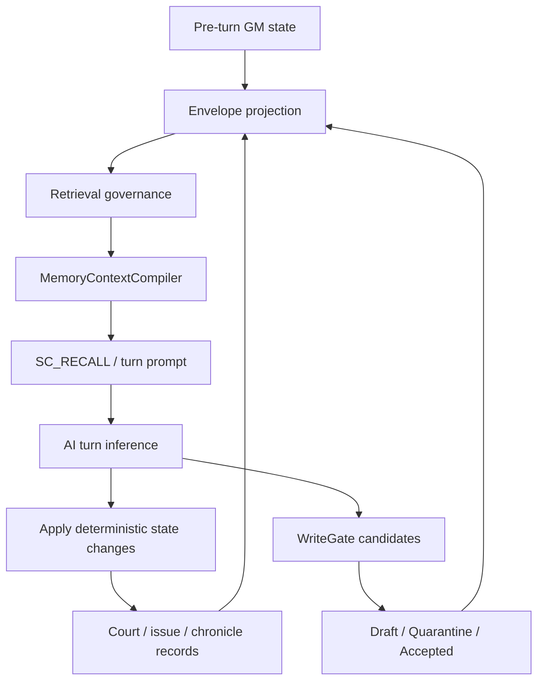

# AI Turn Inference Memory Expansion Plan

> **For agentic workers:** REQUIRED SUB-SKILL: Use superpowers:subagent-driven-development (recommended) or superpowers:executing-plans to implement this plan task-by-task. Steps use checkbox (`- [ ]`) syntax for tracking.

**Goal:** Expand the AI memory system around end-turn inference so chronicle, state-affair records, and character memory become governed inputs and outputs of every turn.

**Architecture:** Keep `TM.MemoryEnvelope` as the single projection layer and `TM.MemoryContextCompiler` as the only prompt-facing compiler. Add turn-inference specific taxonomy, richer projections, and post-turn writeback routing without allowing AI text to bypass WriteGate, Envelope, safeBody, readScope, authority, or Controls/Edges.

**Tech Stack:** Plain browser JavaScript, `GM` runtime state, `TM.MemoryEnvelope`, `TM.MemoryRetrieval`, `TM.MemoryContextCompiler`, `TM.MemoryWriteGate`, Node smoke scripts.

---

## 1. Design Target

The turn AI needs three different memory streams, each with a different truth rule.

1. **Chronicle / 编年**
   - Purpose: preserve historical continuity, date order, long-running affairs, and causality.
   - Sources: `GM.biannianItems`, `GM.yearlyChronicles`, `GM.shijiHistory`, `GM.qijuHistory`, `ChronicleSystem.monthDrafts`, `ChronicleSystem.yearSummaries`, `GM._chronicleTracks`.
   - Prompt role: "what has already happened and how it fits into the historical sequence."
   - Authority default: `structured_chronicle`, upgraded to `official_record` only when produced by deterministic official-record code, never by raw AI summary.

2. **State Affairs / 时政记**
   - Purpose: track active political problems, pending decisions, resolved issues, and unresolved pressure.
   - Sources: `GM.currentIssues`, issue resolution records, court decisions, edicts, `_courtRecords`, relevant `qijuHistory`.
   - Prompt role: "what needs governing now, what was already decided, and what remains unresolved."
   - Authority default: active issue is `ai_analysis` or `court_report`; player/court resolution is `rule_validated` or `player_pin`.

3. **Character Memory / 人物记忆**
   - Purpose: track NPC commitments, grudges, favors, beliefs, relationship changes, private knowledge, and public reputation.
   - Sources: `GM._npcCommitments`, `GM._npcRelationEvents`, accepted WriteGate facts, `jishiRecords`, selected `char._memory` compatibility data.
   - Prompt role: "what this actor knows, remembers, owes, fears, or intends."
   - Authority default: engine hard state remains `engine_state`; AI-extracted beliefs and interpretations enter as draft/accepted `ai_extracted`, never as hard state.

These streams must not become parallel prompt systems. They must project into Envelope, pass retrieval governance, then compile into `<memory-context>`.

---

## 2. Turn Data Flow



Pre-turn memory only reads governed Envelopes. Post-turn memory writes split into two paths:

- Deterministic game facts: write to the owning GM store, then project as Envelope on the next collect.
- AI interpretations: enqueue through WriteGate, reviewed/accepted before becoming recallable facts.

---

## 3. Taxonomy Contract

Add or standardize the following Envelope types:

| Type | Stream | Authority | Lane | Meaning |
| --- | --- | --- | --- | --- |
| `chronicle_event` | 编年 | `structured_chronicle` | `L7_chronicle_context` | A dated event in annal order. |
| `historiography_summary` | 编年 | `structured_chronicle` | `L7_chronicle_context` | Month/year/period historical summary. |
| `ongoing_affair` | 编年+时政 | `court_report` or `structured_chronicle` | `L3_long_term_affair` | A multi-turn affair that remains active. |
| `strategic_issue` | 时政 | `ai_analysis` or `court_report` | `L5_advisory_context` | Active issue needing attention. |
| `issue_resolution` | 时政 | `rule_validated` or `player_pin` | `L2_active_law_commitment` | Player/court resolution of an issue. |
| `issue_update` | 时政 | `court_report` | `L5_advisory_context` | Progress, escalation, or decay of an issue. |
| `character_memory` | 人物 | `ai_extracted` or `court_report` | `L6_retrieved_evidence` | Accepted memory about one actor. |
| `character_belief` | 人物 | `ai_extracted` | `L6_retrieved_evidence` | What an actor believes, scoped by readScope. |
| `relationship_event` | 人物 | `event_log` or `court_report` | `L6_retrieved_evidence` | Favor, grudge, oath, betrayal, alliance shift. |
| `commitment` | 人物+时政 | `player_pin` or `court_report` | `L2_active_law_commitment` | Promise or assigned duty still binding. |

Rules:

- `hard_state` is only for deterministic state such as alive/dead, office, location, faction, edict state.
- `character_belief` and private `character_memory` must carry `ownerScope` and `readScope`.
- `issue_resolution` supersedes earlier `strategic_issue` facts for current-state retrieval, using `GM._memEdges` with `supersedes`.
- `chronicle_event` can preserve superseded history as history, but current prompt sections must mark stale records clearly or suppress them.

---

## 4. Source Matrix

| Source Store | Current Projection | Gap | Desired Projection |
| --- | --- | --- | --- |
| `GM.currentIssues` | `strategic_issue` | no distinct resolution/update types | split active issue, issue update, and issue resolution |
| `GM.biannianItems` | `chronicle_event` | basic body only | add period/date/category/entities/issue refs |
| `GM.yearlyChronicles` | not directly projected | year summary can be invisible | add `pushYearlyChronicleEnvelopes` |
| `GM.shijiHistory` | `episodic_event` | under-ranked for historical use | map official entries to `chronicle_event` or `historiography_summary` |
| `GM.qijuHistory` | action/record/event | some official records land in L6 | official records should prefer `official_record` + L7 or L2 by content |
| `GM.jishiRecords` | `court_dialogue_record` | character-specific memory not extracted | add optional character memory candidates via WriteGate |
| `GM._npcRelationEvents` | `relationship_event` | good base | add `ownerScope/readScope` and basis refs |
| `GM._memoryAccepted` | generic accepted memory | no character stream specialization | preserve accepted type, section by type/source |
| `GM._courtRecords` | court record/resolution | already covered | use as high-authority source for issue resolution and character-facing consequences |

---

## 5. Compiler Sections

Extend `TM.MemoryContextCompiler.SECTION_ORDER` from:

```js
[
  'coreFacts',
  'courtRecords',
  'chronology',
  'recentEvents',
  'relationshipFacts',
  'warnings'
]
```

to:

```js
[
  'coreFacts',
  'courtRecords',
  'stateAffairs',
  'chronology',
  'characterMemory',
  'recentEvents',
  'warnings'
]
```

Section meanings:

- `coreFacts`: hard state and active binding law.
- `courtRecords`: adjudicated debates, court resolutions, basis refs.
- `stateAffairs`: active/resolved issues, policy pressure, unresolved governance agenda.
- `chronology`: annal sequence, historical summaries, ongoing tracks.
- `characterMemory`: actor-scoped beliefs, grudges, favors, commitments, relationship memories.
- `recentEvents`: low-structure events not yet promoted.
- `warnings`: rumor, vector, low-authority summary, suppressed or cautionary context.

`stateAffairs` should come before `chronology` because the turn AI must know current governing obligations before narrative history. `characterMemory` comes after chronology so actor behavior is grounded in history, but before recent low-structure events.

---

## 6. Prompt Policy

For end-turn AI inference, compile with:

```js
TM.MemoryContextCompiler.compileFromGM(GM, {
  turn: GM.turn,
  audience: 'system',
  actorScope: 'system',
  intent: 'turn_inference',
  maxTokens: P.conf && P.conf.memoryContextTokens || 1800
});
```

For actor-specific dialogue or faction actions:

```js
TM.MemoryContextCompiler.compileFromGM(GM, {
  turn: GM.turn,
  audience: 'npc:' + npcId,
  actorScope: 'npc:' + npcId,
  actorId: npcId,
  factionId: factionId,
  intent: 'actor_decision',
  maxTokens: 900
});
```

Prompt constraints:

- Never inject raw `GM.currentIssues`, raw `char._memory`, raw AI summary, draft, or quarantine text directly.
- Only inject compiler output.
- Include diagnostics in trace, not in model-facing prose unless the section is `warnings`.
- Current facts suppress superseded facts; historical explanation may include superseded facts only with stale status.

---

## 7. Implementation Tasks

### Task 1: Add Projection Golden For Turn Memory Streams

**Files:**
- Create: `web/scripts/smoke-memory-turn-inference-projection.js`
- Modify: `web/scripts/verify-all.js`

- [ ] **Step 1: Write failing smoke**

Create `web/scripts/smoke-memory-turn-inference-projection.js`:

```js
#!/usr/bin/env node
'use strict';

const fs = require('fs');
const path = require('path');
const vm = require('vm');

const ROOT = path.resolve(__dirname, '..');
function assert(cond, msg) { if (!cond) throw new Error(msg); }

const sandbox = { window: {}, console };
sandbox.window = sandbox;
sandbox.globalThis = sandbox;
vm.createContext(sandbox);

[
  'tm-memory-evidence-registry.js',
  'tm-memory-envelope.js',
  'tm-memory-controls.js',
  'tm-memory-retrieval.js',
  'tm-context-zones.js',
  'tm-memory-context-compiler.js'
].forEach((file) => {
  vm.runInContext(fs.readFileSync(path.join(ROOT, file), 'utf8'), sandbox, { filename: file });
});

const GM = {
  turn: 12,
  sid: 'sc-test',
  currentIssues: [
    { id: 'issue-tax', title: '辽饷加派', description: '辽饷缺口扩大', status: 'active', raisedTurn: 10, linkedChars: ['毕自严'] },
    { id: 'issue-wei', title: '魏忠贤处置', description: '阉党去留已裁', status: 'resolved', raisedTurn: 8, resolvedTurn: 11, resolution: '贬凤阳' }
  ],
  biannianItems: [
    { id: 'bn-11', turn: 11, title: '贬魏忠贤', content: '十一回合，诏贬魏忠贤凤阳。', category: 'court' }
  ],
  yearlyChronicles: [
    { id: 'yc-1627', year: 1627, turn: 12, summary: '天启七年秋，内廷阉党渐去。' }
  ],
  _npcRelationEvents: [
    { id: 'rel-1', turn: 11, actor: '毕自严', target: '朱由检', kind: 'trust_gain', text: '因辽饷议奏得信任。' }
  ],
  _memoryAccepted: [
    { id: 'char-mem-1', type: 'character_memory', status: 'active', body: '毕自严记得皇帝承诺三日内复核辽饷。', safeBody: '毕自严记得皇帝承诺三日内复核辽饷。', authority: 'ai_extracted', turn: 11, entities: ['毕自严'], sourceRefs: [{ type: 'jishiRecords', id: 'jr-1' }] }
  ]
};

const compiled = sandbox.TM.MemoryContextCompiler.compileFromGM(GM, {
  turn: 12,
  audience: 'system',
  actorScope: 'system',
  intent: 'turn_inference',
  maxTokens: 1600
});

assert(compiled.text.includes('<memory-context'), 'compiled context exists');
assert(compiled.text.includes('辽饷加派'), 'state issue appears');
assert(compiled.text.includes('贬魏忠贤'), 'chronicle event appears');
assert(compiled.text.includes('天启七年秋'), 'yearly chronicle appears');
assert(compiled.text.includes('毕自严记得'), 'character memory appears');
assert(!compiled.text.includes('undefined'), 'compiled context has no undefined text');

console.log('smoke-memory-turn-inference-projection ok');
```

- [ ] **Step 2: Run test and verify it fails**

Run:

```powershell
node web\scripts\smoke-memory-turn-inference-projection.js
```

Expected before implementation: FAIL because yearly chronicles and/or specialized sections are not projected or not sectioned.

- [ ] **Step 3: Add to verify-all**

Add this check after `memory-e2e-game-golden`:

```js
{ name: 'memory-turn-inference-projection', file: 'smoke-memory-turn-inference-projection.js', estSec: 1, expectExit: 0 },
```

- [ ] **Step 4: Run targeted manifest checks**

Run:

```powershell
node web\scripts\smoke-memory-manifest.js
node web\scripts\smoke-memory-turn-inference-projection.js
```

Expected after implementation: both PASS.

### Task 2: Extend Envelope Projections For Yearly Chronicles And Issue Resolutions

**Files:**
- Modify: `web/tm-memory-envelope.js`
- Test: `web/scripts/smoke-memory-turn-inference-projection.js`

- [ ] **Step 1: Add helper for issue resolution detection**

Near `pushIssueEnvelopes`, add:

```js
function issueHasResolution(issue) {
  return !!(issue && (
    issue.resolution || issue.result || issue.outcome || issue.playerChoice ||
    issue.resolvedTurn || issue.resolvedAtTurn || issue.status === 'resolved'
  ));
}
```

- [ ] **Step 2: Split active issue and resolution projection**

Inside `pushIssueEnvelopes`, choose type/authority/lane:

```js
var resolved = issueHasResolution(issue);
out.push(makeEnvelope({
  id: issue.id || ('issue-' + i),
  type: resolved ? 'issue_resolution' : 'strategic_issue',
  body: body,
  sourceRefs: [sourceRef('currentIssues', issue.id || ('issue-' + i), body, { turn: issue.raisedTurn || issue.turn || turn })],
  status: issue.status || 'active',
  authority: resolved ? (issue.authority || 'rule_validated') : (issue.authorityLevel || issue.authority || 'ai_analysis'),
  visibility: issue.visibility || 'public',
  turn: Number(issue.resolvedTurn || issue.resolvedAtTurn || issue.raisedTurn || issue.turn || turn || 0),
  entities: [].concat(issue.linkedChars || [], issue.linkedFactions || []),
  lane: resolved ? 'L2_active_law_commitment' : 'L5_advisory_context',
  reason: resolved ? 'projection:issue_resolution' : 'projection:current_issue',
  extra: {
    category: issue.category || '',
    severity: issue.severity || '',
    issueStatus: issue.status || '',
    resolution: issue.resolution || issue.result || issue.outcome || issue.playerChoice || ''
  }
}));
```

- [ ] **Step 3: Add yearly chronicle projection**

Add:

```js
function pushYearlyChronicleEnvelopes(out, GM, turn) {
  if (!GM || !Array.isArray(GM.yearlyChronicles)) return;
  GM.yearlyChronicles.slice(-36).forEach(function(y, i) {
    if (!y) return;
    var body = [y.title, y.year, y.summary, y.content, y.afterword, y.text].filter(Boolean).join(' ');
    if (!body) return;
    var id = y.id || ('yearly-chronicle-' + (y.year || y.turn || i));
    out.push(makeEnvelope({
      id: id,
      type: 'historiography_summary',
      body: body,
      sourceRefs: [sourceRef('yearlyChronicles', id, body, { turn: y.turn || turn })],
      status: y.status || 'active',
      authority: y.authority || 'structured_chronicle',
      visibility: y.visibility || 'public',
      turn: Number(y.turn || turn || 0),
      entities: [].concat(y.entities || []),
      lane: 'L7_chronicle_context',
      reason: 'projection:yearly_chronicle',
      extra: { year: y.year || '' }
    }));
  });
}
```

- [ ] **Step 4: Call the new projection**

In `collect(GM, opts)`, insert after `pushBiannianEnvelopes`:

```js
pushYearlyChronicleEnvelopes(out, GM, turn);
```

- [ ] **Step 5: Verify**

Run:

```powershell
node --check web\tm-memory-envelope.js
node web\scripts\smoke-memory-turn-inference-projection.js
```

Expected: PASS.

### Task 3: Add State Affairs And Character Memory Compiler Sections

**Files:**
- Modify: `web/tm-memory-context-compiler.js`
- Test: `web/scripts/smoke-memory-turn-inference-projection.js`

- [ ] **Step 1: Extend section order**

Replace `SECTION_ORDER` with:

```js
var SECTION_ORDER = [
  'coreFacts',
  'courtRecords',
  'stateAffairs',
  'chronology',
  'characterMemory',
  'recentEvents',
  'warnings'
];
```

- [ ] **Step 2: Add section metadata**

Add:

```js
stateAffairs: ['state-affairs', 'state affairs and unresolved political issues'],
characterMemory: ['character-memory', 'character memories and actor-scoped facts'],
```

- [ ] **Step 3: Extend source/type mapping**

Add to `SOURCE_SECTION`:

```js
strategic_issue: 'stateAffairs',
issue_resolution: 'stateAffairs',
issue_update: 'stateAffairs',
ongoing_affair: 'stateAffairs',
character_memory: 'characterMemory',
character_belief: 'characterMemory',
relationship_event: 'characterMemory',
court_dialogue_record: 'characterMemory',
```

- [ ] **Step 4: Strengthen `sectionFor`**

Before lane fallbacks, add:

```js
var type = clean(hit.type || hit.factStatus || '', 80);
if (type === 'issue_resolution' || type === 'strategic_issue' || type === 'issue_update') return 'stateAffairs';
if (type === 'character_memory' || type === 'character_belief' || type === 'relationship_event' || type === 'court_dialogue_record') return 'characterMemory';
if (type === 'chronicle_event' || type === 'historiography_summary') return 'chronology';
```

- [ ] **Step 5: Verify**

Run:

```powershell
node --check web\tm-memory-context-compiler.js
node web\scripts\smoke-memory-context-compiler.js
node web\scripts\smoke-memory-turn-inference-projection.js
```

Expected: all PASS.

### Task 4: Add Character Memory ReadScope Golden

**Files:**
- Create: `web/scripts/smoke-memory-character-scope.js`
- Modify: `web/scripts/verify-all.js`

- [ ] **Step 1: Create smoke**

```js
#!/usr/bin/env node
'use strict';

const fs = require('fs');
const path = require('path');
const vm = require('vm');
const ROOT = path.resolve(__dirname, '..');
function assert(cond, msg) { if (!cond) throw new Error(msg); }

const sandbox = { window: {}, console };
sandbox.window = sandbox;
sandbox.globalThis = sandbox;
vm.createContext(sandbox);

[
  'tm-memory-evidence-registry.js',
  'tm-memory-envelope.js',
  'tm-memory-controls.js',
  'tm-memory-retrieval.js',
  'tm-context-zones.js',
  'tm-memory-context-compiler.js'
].forEach((file) => vm.runInContext(fs.readFileSync(path.join(ROOT, file), 'utf8'), sandbox, { filename: file }));

const GM = {
  turn: 7,
  _memoryAccepted: [
    {
      id: 'private-belief-1',
      type: 'character_belief',
      status: 'active',
      body: '韩爌私下认为魏忠贤不可骤杀。',
      safeBody: '韩爌私下认为魏忠贤不可骤杀。',
      authority: 'ai_extracted',
      turn: 6,
      entities: ['韩爌', '魏忠贤'],
      ownerScope: 'npc:han-kuang',
      readScope: 'npc:han-kuang',
      sourceRefs: [{ type: 'jishiRecords', id: 'jr-private' }]
    }
  ]
};

const publicCtx = sandbox.TM.MemoryContextCompiler.compileFromGM(GM, {
  turn: 7,
  audience: 'public',
  actorScope: 'system',
  intent: 'turn_inference'
});
assert(!publicCtx.text.includes('不可骤杀'), 'private belief hidden from public/system default');

const npcCtx = sandbox.TM.MemoryContextCompiler.compileFromGM(GM, {
  turn: 7,
  audience: 'npc:han-kuang',
  actorScope: 'npc:han-kuang',
  actorId: 'han-kuang',
  intent: 'actor_decision'
});
assert(npcCtx.text.includes('不可骤杀'), 'private belief visible to owning actor');

console.log('smoke-memory-character-scope ok');
```

- [ ] **Step 2: Add to verify-all**

Add near memory retrieval/visibility checks:

```js
{ name: 'memory-character-scope', file: 'smoke-memory-character-scope.js', estSec: 1, expectExit: 0 },
```

- [ ] **Step 3: Verify**

Run:

```powershell
node web\scripts\smoke-memory-character-scope.js
node web\scripts\smoke-memory-manifest.js
```

Expected: both PASS.

### Task 5: Add Post-Turn Candidate Builder

**Files:**
- Create: `web/tm-memory-turn-inference.js`
- Modify: `web/index.html`
- Test: `web/scripts/smoke-memory-turn-writeback.js`

- [ ] **Step 1: Create module shell**

```js
(function(global) {
  'use strict';

  var root = global || (typeof window !== 'undefined' ? window : {});
  root.TM = root.TM || {};
  var ns = root.TM.MemoryTurnInference = root.TM.MemoryTurnInference || {};

  function arr(value) { return Array.isArray(value) ? value : []; }
  function clean(value, maxLen) {
    var s = String(value == null ? '' : value).replace(/\s+/g, ' ').trim();
    return maxLen ? s.slice(0, maxLen) : s;
  }

  function sourceRef(type, id, body, turn) {
    var ME = root.TM && root.TM.MemoryEnvelope;
    if (ME && typeof ME.sourceRef === 'function') return ME.sourceRef(type, id, body, { turn: turn });
    return { type: type, id: id, turn: turn };
  }

  function characterMemoryCandidates(GM, aiResult, opts) {
    opts = opts || {};
    var turn = Number((GM && GM.turn) || opts.turn || 0);
    var out = [];
    arr(aiResult && aiResult.character_memory_updates).forEach(function(item, i) {
      var actor = clean(item.actor || item.char || item.name, 80);
      var body = clean(item.memory || item.text || item.summary, 500);
      if (!actor || !body) return;
      out.push({
        id: item.id || ('char-memory-' + turn + '-' + i),
        type: item.private ? 'character_belief' : 'character_memory',
        body: body,
        safeBody: body,
        authority: 'ai_extracted',
        turn: turn,
        entities: [actor].concat(arr(item.entities)),
        ownerScope: item.ownerScope || ('npc:' + actor),
        readScope: item.private ? (item.readScope || ('npc:' + actor)) : (item.readScope || 'public'),
        sourceRefs: [sourceRef(item.sourceType || 'aiTurnResult', item.sourceId || ('turn-' + turn), body, turn)],
        lane: 'L6_retrieved_evidence',
        reason: 'turn-inference:character-memory'
      });
    });
    return out;
  }

  function enqueueCandidates(GM, candidates, opts) {
    var WG = root.TM && root.TM.MemoryWriteGate;
    if (!WG || typeof WG.enqueue !== 'function') return { added: 0, missingWriteGate: true };
    var added = 0;
    arr(candidates).forEach(function(candidate) {
      var item = WG.enqueue(GM, candidate, opts || {});
      if (item) added++;
    });
    return { added: added };
  }

  function collectPostTurnCandidates(GM, aiResult, opts) {
    return characterMemoryCandidates(GM, aiResult, opts);
  }

  ns.collectPostTurnCandidates = collectPostTurnCandidates;
  ns.enqueueCandidates = enqueueCandidates;
})(typeof window !== 'undefined' ? window : (typeof globalThis !== 'undefined' ? globalThis : this));
```

- [ ] **Step 2: Load module**

In `web/index.html`, load after WriteGate and before context compiler:

```html
<script src="tm-memory-turn-inference.js?v=20260601-turn-inference"></script>
```

- [ ] **Step 3: Write smoke**

Create `web/scripts/smoke-memory-turn-writeback.js` to verify:

```js
#!/usr/bin/env node
'use strict';

const fs = require('fs');
const path = require('path');
const vm = require('vm');
const ROOT = path.resolve(__dirname, '..');
function assert(cond, msg) { if (!cond) throw new Error(msg); }

const sandbox = { window: {}, console, Date, Math };
sandbox.window = sandbox;
sandbox.globalThis = sandbox;
vm.createContext(sandbox);

[
  'tm-memory-evidence-registry.js',
  'tm-memory-envelope.js',
  'tm-memory-writegate.js',
  'tm-memory-turn-inference.js'
].forEach((file) => vm.runInContext(fs.readFileSync(path.join(ROOT, file), 'utf8'), sandbox, { filename: file }));

const GM = { turn: 9 };
const candidates = sandbox.TM.MemoryTurnInference.collectPostTurnCandidates(GM, {
  character_memory_updates: [
    { actor: '韩爌', memory: '韩爌因复起诏书而对新帝稍增信任。', private: false },
    { actor: '温体仁', memory: '温体仁私下担忧东林复起。', private: true }
  ]
});

assert(candidates.length === 2, 'two character candidates');
assert(candidates[0].readScope === 'public', 'public memory readScope');
assert(candidates[1].readScope === 'npc:温体仁', 'private memory readScope');

const result = sandbox.TM.MemoryTurnInference.enqueueCandidates(GM, candidates, { forceDraft: true });
assert(result.added === 2, 'two candidates enqueued');
assert(GM._memoryDraftInbox.length === 2, 'draft inbox receives AI memories');
assert(!GM._memoryAccepted || GM._memoryAccepted.length === 0, 'drafts are not accepted automatically');

console.log('smoke-memory-turn-writeback ok');
```

- [ ] **Step 4: Verify**

Run:

```powershell
node --check web\tm-memory-turn-inference.js
node web\scripts\smoke-memory-turn-writeback.js
```

Expected: PASS.

### Task 6: Integrate Post-Turn Candidate Builder Into EndTurn

**Files:**
- Modify: `web/tm-endturn-ai.js` or the module that owns parsed `p1`
- Test: `web/scripts/smoke-memory-recall-injection-lineage.js`, `web/scripts/smoke-memory-turn-writeback.js`

- [ ] **Step 1: Locate parsed AI result writeback point**

Search:

```powershell
rg -n "GM._turnAiResults|applyAITurnChanges|subcall1|p1" web\tm-endturn-ai.js web\tm-endturn-apply.js
```

- [ ] **Step 2: Add guarded enqueue after AI result parse and before final trace**

Use this guarded block where `p1` or the normalized turn AI result is available:

```js
try {
  if (global.TM && global.TM.MemoryTurnInference && typeof global.TM.MemoryTurnInference.collectPostTurnCandidates === 'function') {
    var _memCandidates = global.TM.MemoryTurnInference.collectPostTurnCandidates(GM, p1 || {}, {
      turn: GM && GM.turn,
      sourceId: 'SC1'
    });
    if (_memCandidates && _memCandidates.length && typeof global.TM.MemoryTurnInference.enqueueCandidates === 'function') {
      var _memWrite = global.TM.MemoryTurnInference.enqueueCandidates(GM, _memCandidates, { forceDraft: true });
      if (global.TM.MemoryTrace && typeof global.TM.MemoryTrace.recordInjection === 'function') {
        global.TM.MemoryTrace.recordInjection(GM, {
          stage: 'postturn-memory-candidates',
          status: 'drafted',
          count: _memWrite && _memWrite.added || 0
        });
      }
    }
  }
} catch (_turnMemE) {
  try { if (global.TM && TM.errors && TM.errors.captureSilent) TM.errors.captureSilent(_turnMemE, 'postturn-memory-candidates'); } catch (_) {}
}
```

- [ ] **Step 3: Verify no hard-state bypass**

Add an assertion to `smoke-memory-turn-writeback.js` that a candidate with `type: 'hard_state'` from AI becomes quarantined via WriteGate.

- [ ] **Step 4: Run targeted tests**

Run:

```powershell
node web\scripts\smoke-memory-turn-writeback.js
node web\scripts\smoke-memory-recall-injection-lineage.js
node web\scripts\smoke-memory-injection-guarantees.js
```

Expected: all PASS.

### Task 7: Add Governance Edges For Issue Resolution

**Files:**
- Modify: `web/tm-memory-controls.js` or `web/tm-memory-turn-inference.js`
- Test: `web/scripts/smoke-memory-turn-issue-supersedes.js`

- [ ] **Step 1: Create issue supersedes helper**

Add helper:

```js
function createIssueResolutionEdge(GM, issueId, resolutionId, turn) {
  if (!GM) return null;
  GM._memEdges = Array.isArray(GM._memEdges) ? GM._memEdges : [];
  var edge = {
    id: 'edge-issue-resolution-' + issueId + '-' + resolutionId,
    type: 'supersedes',
    from: resolutionId,
    to: issueId,
    turn: Number(turn || GM.turn || 0),
    reason: 'issue_resolution'
  };
  GM._memEdges.push(edge);
  return edge;
}
```

- [ ] **Step 2: Call helper when projecting or writing issue resolution**

When an issue gains resolution, create:

```js
createIssueResolutionEdge(GM, 'issue-' + issue.id, 'issue-resolution-' + issue.id, issue.resolvedTurn || GM.turn);
```

- [ ] **Step 3: Smoke test**

Verify that current retrieval suppresses the unresolved issue when a resolution edge exists, while historical retrieval can still show both with status.

Run:

```powershell
node web\scripts\smoke-memory-turn-issue-supersedes.js
```

Expected: PASS.

### Task 8: Final Verification

**Files:**
- `web/scripts/verify-all.js`

- [ ] **Step 1: Run all new memory smokes**

```powershell
node web\scripts\smoke-memory-turn-inference-projection.js
node web\scripts\smoke-memory-character-scope.js
node web\scripts\smoke-memory-turn-writeback.js
node web\scripts\smoke-memory-turn-issue-supersedes.js
```

- [ ] **Step 2: Run full gate**

```powershell
node web\scripts\verify-all.js
```

Expected:

```text
[verify-all] all checks passed
```

---

## 8. Phasing

### Phase A: Projection And Compiler

Build Tasks 1-4 first. This makes existing game stores visible to retrieval without changing AI behavior.

Deliverable:
- Yearly chronicle, issue resolution, character memory, and readScope goldens pass.
- End-turn prompt can include richer context if already present in GM.

### Phase B: Post-Turn Writeback

Build Tasks 5-6. This lets AI propose character memories, but only as Draft/Quarantine through WriteGate.

Deliverable:
- AI-generated character memory never becomes active unless accepted.
- Prompt injection and unauthorized hard state still quarantine.

### Phase C: Resolution Edges And Long-Term Governance

Build Task 7. This gives current-state retrieval the ability to suppress stale issues while preserving historical trace.

Deliverable:
- Resolved state affairs do not keep reappearing as active obligations.
- Historical query can still explain how the issue evolved.

---

## 9. Non-Goals

- Do not replace `GM.currentIssues`, `GM.biannianItems`, `GM.shijiHistory`, or character state stores.
- Do not let the AI write `hard_state`.
- Do not inject `char._memory` or raw AI result text directly into prompt.
- Do not create a vector-only memory path that bypasses Envelope.
- Do not make `MemoryContextCompiler` responsible for writing memory; it only compiles.

---

## 10. Self-Review

Spec coverage:

- Envelope schema remains the source contract.
- WriteGate lifecycle is preserved for AI-generated character memories.
- Draft/Quarantine/Accepted cannot leak into prompt because retrieval only uses projected active accepted records.
- CourtRecord authority remains higher than strategic issues and rumors.
- Controls/Edges handle issue supersession.
- Chronicle, state affairs, and character memory each have source stores, Envelope types, lanes, and smoke gates.

Placeholder scan:

- No implementation step uses TBD/TODO language.
- Each code-changing task includes concrete snippets and commands.

Type consistency:

- `issue_resolution`, `character_memory`, `character_belief`, and `historiography_summary` are introduced in taxonomy, projection, compiler mapping, and tests.
- `readScope`, `ownerScope`, `safeBody`, `sourceRefs`, and `basisRefs` remain consistent with the Memory Envelope contract.
